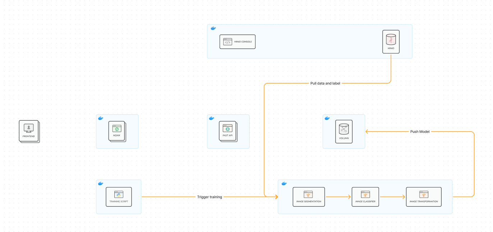

# honeyComb

### Architectural design
#### Usage data flow


#### Training flow



### Staring the project
```
cd honeycomb
docker compose up
```

### Port mapping
- localhost:12021 -> ingress
- localshot:12022 -> minio


### Ingress mapping
- localhost:12021/api -> center api
- localhost:12021/cls/api -> classification api
- localhost:12021/seg/api -> segmentation api
- localhost:12021/trans/api -> transformation api

---

### Preparation for training
#### with GPU
1. you need to have TensorFlow Docker which can be install base on this documentation -> https://www.tensorflow.org/install/docker
2. you also need to install NVIDIA Container Toolkit -> https://github.com/NVIDIA/nvidia-container-toolkit
3. validate that you can run TensorFlow Docker with gpu

3.1 check the installation of NVIDIA Container Toolkit
```
sudo docker run --rm --runtime=nvidia --gpus all ubuntu nvidia-smi
```

3.2 check running tensorflow in container with gpu
```
docker run --gpus all -it --rm tensorflow/tensorflow:latest-gpu \
   python -c "import tensorflow as tf; print(tf.reduce_sum(tf.random.normal([1000, 1000])))"
```

#### with CPU
1. you need to have TensorFlow Docker which can be install base on this documentation -> https://www.tensorflow.org/install/docker
2.  validate that you can run TensorFlow Docker with
2.1 check running tensorflow in container with cpu only
```
docker run -it --rm tensorflow/tensorflow \
   python -c "import tensorflow as tf; print(tf.reduce_sum(tf.random.normal([1000, 1000])))"
```
----


### Training step
#### Training classification
1. run docker tensorflow 2.13.0-gpu (or 2.13.0 if using only CPU) with interaction mode
```
docker run --gpus all -it --rm -v ./models/classification:/home tensorflow/tensorflow:2.13.0-gpu
```

2. change location to /home in container
```
cd /home
```

3.install requirement
```
pip install -r requirements_train.txt
```

3. run traing 
```
python trainer.py --data ./example_data --save_folder ./mymodel --initial_epochs 10 --fine_tune_epochs 400
```

- (optional) you can optimize paramaters --datam, --save_folder, --initial_epochs, --fine_tune_epochs as you wish


#### Training Transformation
- docker run --gpus all -it --rm -v .:/home tensorflow/tensorflow:2.12.0-gpu
- pip install -r requirements_train.txt
- apt-get update && apt-get install -y libgl1-mesa-glx libmagic1
- gdown https://drive.google.com/uc?id=1SaCURxgqb0O6D9KnDgX4PrDDjf5mLTXv -O /root/.data/DECIMER-V2/DECIMER_model.zip
- create tfrecord from images
- gdown https://drive.google.com/uc?id=1TZQtVsYn6R5kWtAZ_g3EDAL-i1tFIjxY -O /root/.data/DECIMER-V2/DECIMER_HandDrawn_model.zip
- unzip /root/.data/DECIMER-V2/DECIMER_model.zip -d /root/.data/DECIMER-V2/
- unzip /root/.data/DECIMER-V2/DECIMER_HandDrawn_model.zip -d /root/.data/DECIMER-V2/
```
python decimer_transformation/Utils/Create_TFrecord_From_images.py --smile_path ./example_data/smiles.txt --base_image_path ./example_data/
```
- run training file
```
python -m decimer_transformation.DECIMER_EfficinetNetV2_Transfomer_Trainer
```
